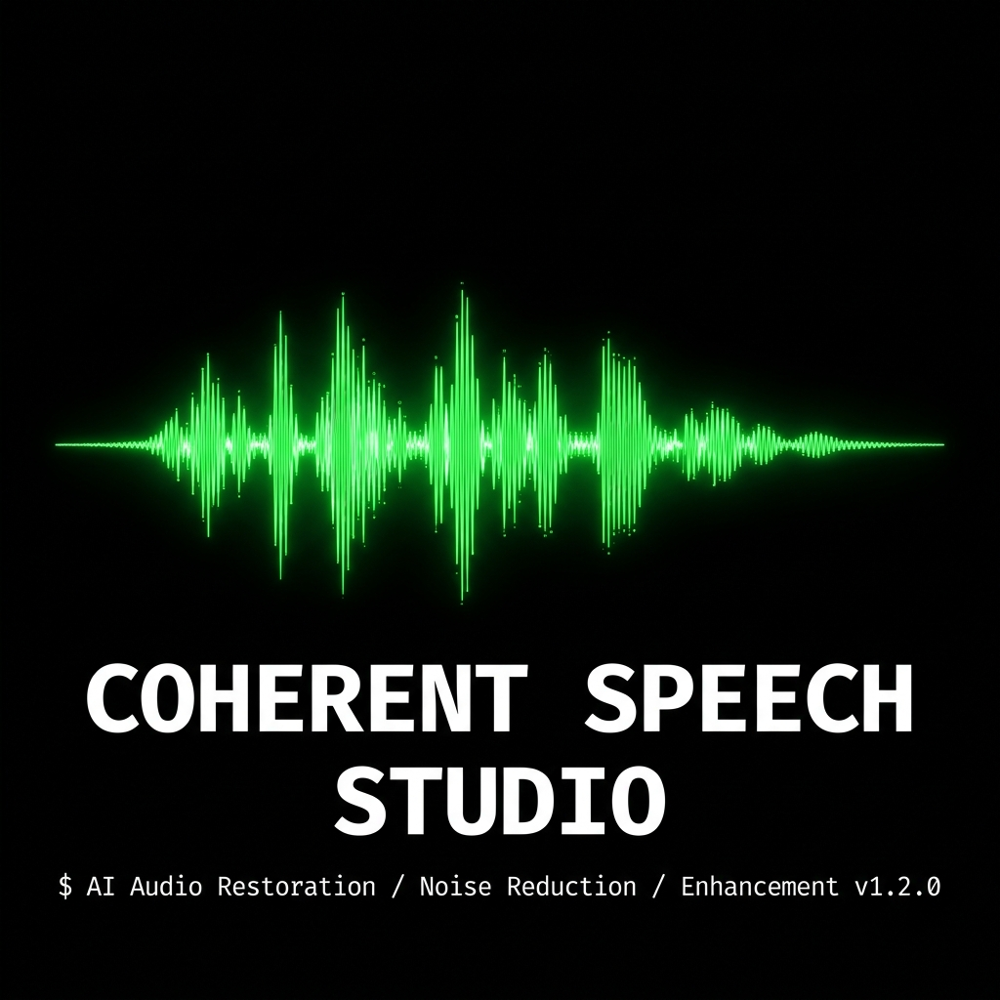
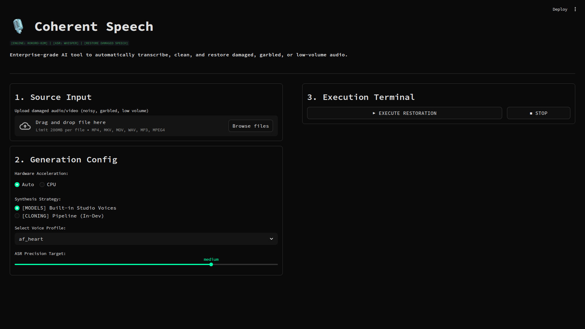

# 🎙️ Coherent Speech Studio

**[🚀 Try the Live App!](https://coherent-speech.streamlit.app/)**

[](https://www.python.org/downloads/)
[](https://opensource.org/licenses/MIT)
[](https://streamlit.io/)

## Overview


Coherent Speech is a high-performance, AI-driven audio and video restoration pipeline. It revitalizes media with poor-quality audio by interpreting the original transcription and reconstructing pristine, studio-quality speech. Using state-of-the-art Natural Language Processing (NLP) and Text-to-Speech (TTS) technologies, it flawlessly aligns new, clean dialogue with the original timeline.

## 🎯 Use Cases

Rather than relying on basic noise reduction, **Coherent Speech** completely rebuilds your audio track:
- **Restoring Damaged Recordings:** Salvage interviews, podcasts, or voice memos that are garbled, noisy, or suffer from severe mic drop-outs.
- **Volume Normalization:** Automatically reconstruct speech that was recorded far too quietly into a rich, full-bodied studio voice.
- **General Media Enhancement:** Upgrade amateur vlog or presentation audio into professional studio-grade quality instantly.

## 🚀 Features

- **High-Fidelity Audio Rebuilding:** Leverages the blazing-fast Kokoro-82M model to generate expressive built-in studio voices.
- **Zero-Shot Voice Cloning (In-Dev):** F5-TTS automatically extracts a "voice map" from your source file to reconstruct speech that still sounds like the original speaker.
- **Robust Automatic Speech Recognition (ASR):** Uses Faster-Whisper to transcribe audio accurately, with an automated disk cache to skip re-transcribing on subsequent runs.
- **Dynamic Hardware Acceleration:** Automatically detects and utilizes NVIDIA GPUs (CUDA) and Apple Silicon M-Series chips (MPS) for maximum inference speed, offering robust multithreaded CPU fallbacks for total portability.
- **Modern User Interface:** A responsive and interactive visual dashboard built with Streamlit, enabling intuitive file uploads, hardware selection, and real-time inference progress tracking.
- **Cross-Platform Speed:** Native Python performance, managed by the blazingly fast `uv` package manager with version-locked safety.

## 📋 Prerequisites

- **Python:** Highly compatible with native Python 3.13.
- **System Packages:**
  - `ffmpeg`: Required for audio extraction and video assembly.
  - `espeak-ng`: System phonemizer required for the Kokoro TTS engine.

On debian/ubuntu machines, you can install the system requirements via:
```sh
sudo apt-get update && sudo apt-get install -y ffmpeg espeak-ng
```

## 🛠️ Setup & Installation

The project uses `uv`, an extremely fast Python package manager.

1. **Clone the repository:**
   ```sh
   git clone https://github.com/anikettuli/coherent-speech.git
   cd coherent-speech
   ```

2. **Automated Setup:**
   Run the provided interactive script to install dependencies, set up the virtual environment, and launch the application all in one go.
   ```sh
   ./run.sh
   ```

3. **Manual Setup (Optional):**
   If you aren't using `run.sh`, you can set up the environment manually with `uv`:
   ```sh
   # Install uv if you don't have it
   curl -LsSf https://astral.sh/uv/install.sh | sh
   
   # Create and activate virtual environment
   uv venv venv
   source venv/bin/activate
   
   # Install dependencies
   uv pip install -r requirements.txt
   
   # Note: For CUDA support, run `uv pip install -r requirements-gpu.txt` as well.
   ```

## 💻 Usage

Start the development server using Streamlit:
```sh
streamlit run streamlit_app.py
```
*(Note: Ensure your `LD_LIBRARY_PATH` is configured correctly for CUDA if you are taking advantage of GPU acceleration. This is handled automatically inside `run.sh`)*

1. **Upload Source:** Upload your target media (mp4, mkv, mov, wav, mp3).
2. **Configure Pipeline:** Select hardware acceleration, Whisper target precision, and the desired Voice Synthesis Strategy (Studio Voices or Voice Cloning).
3. **Execute:** Click "Execute Restoration" to begin processing. You can stop the pipeline halfway gracefully using the visual Stop button.
4. **Download:** Play the fully restored media directly in your browser or download it to your disk.

## 🏗️ Architecture

- `streamlit_app.py`: The user interface and visual configurations. Built with Streamlit, processing logic is scoped to temporary, collision-free directories.
- `pipeline.py`: The core audio/video multiplexing logic. Orchestrates ffmpeg extractions, ASR, TTS inference alignment, and timeline matching natively using CPU limits dynamically.
- `tts_manager.py`: Abstraction layer managing interactions with TTS inferencing engines (Kokoro and F5), including hardware dispatching and memory safe threading operations.
- `run.sh`: Automated application launcher ensuring library bindings and prerequisite package resolutions.

## ⚠️ Known Limitations
- F5-TTS Voice Cloning is heavily experimental ("In-Dev") and requires isolated references.
- `CUDA` Fallback to CPU is extremely stable but noticeably slower.
